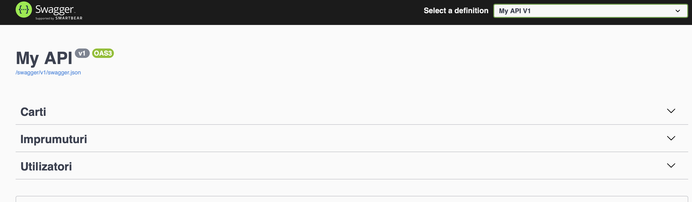
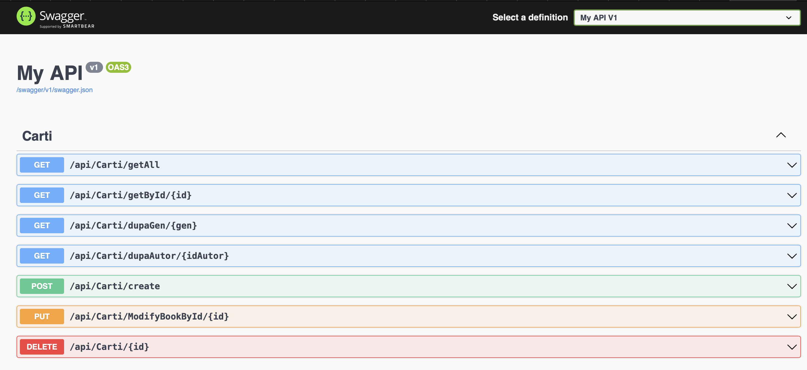
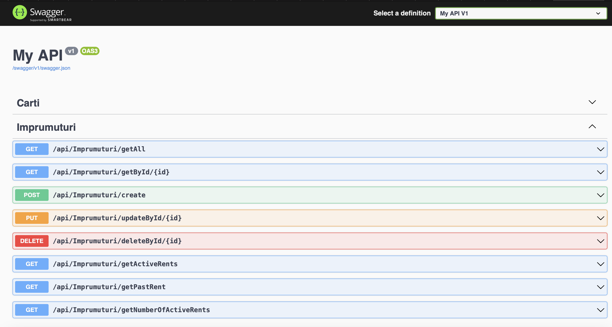
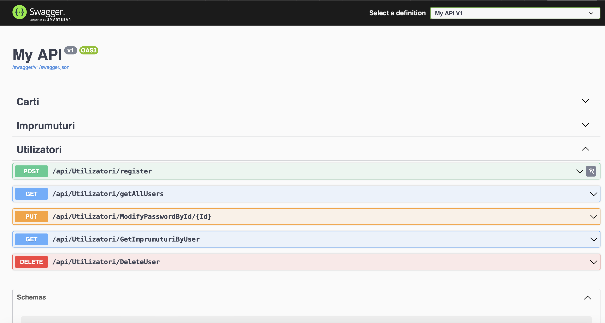

# DAW

### Aplicatie în .NET

#### Cerințe:

Backend (4p) :
3 Controllere (minim); Fiecare Metoda Crud, REST cu date din baza de date. (1p)

CartiCntroller, AutorController, EdituraController

-Cel puțin 1 relație între tabele din fiecare fel (One to One, Many to Many, One to Many); Folosirea metodelor din Linq: GroupBy, Where, etc; Folosirea Join si Include (1p)

Carte - DescriereCarte (One to One)

Utilizator - Imprumut (One to Many)

Carte - Autor (Many to Many)

Carte - Imprumut (Many to Many)

-Autentificare + Roluri; Autorizare pe endpointuri în funcție de Roluri; Cel putin 2 Roluri: Admin, User (1p)

Exista 2 roluri: Admin si User

-Sa se foloseasca repository pattern + Service (1p)
